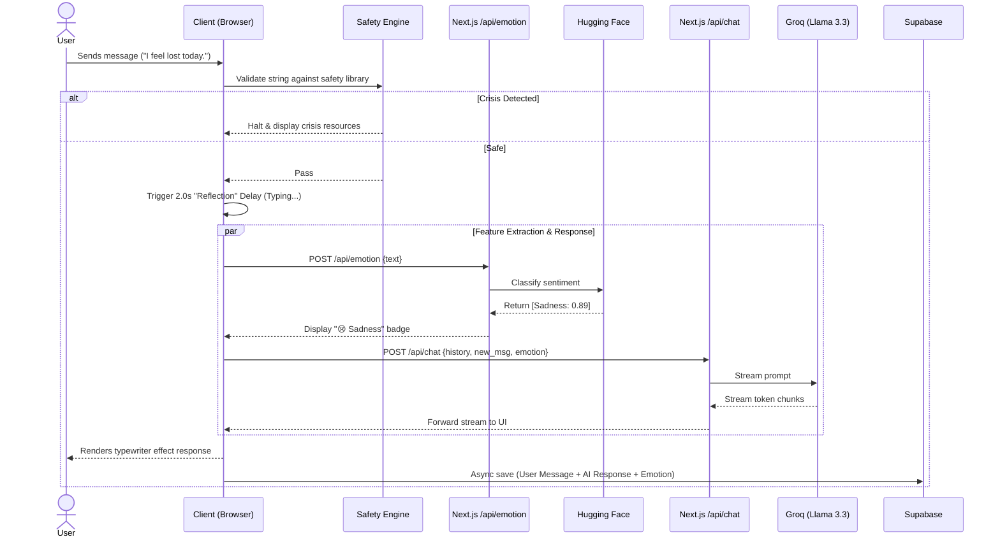
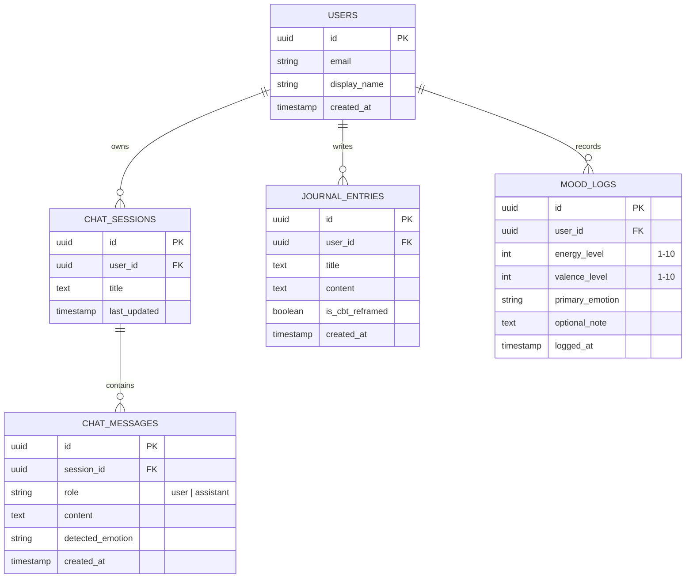

# Lumea - System Architecture & Diagrams 📐

This document provides a highly detailed visual and structural overview of the **Lumea - Celestial Sanctuary**. It maps out user interactions, data streaming cycles, component boundaries, and the modern Next.js architecture that powers the emotional intelligence of the platform.

---

## 👥 1. Use Case Diagram
This diagram illustrates the comprehensive interactions between the User, the system's core modules, and external intelligence providers.

```mermaid
flowchart TD
    %% Actors
    User([User 👤])
    Guest([Unregistered Visitor 🕵️])
    
    %% System Boundary
    subgraph Lumea_Sanctuary [Lumea - Celestial Sanctuary]
        direction TB
        
        %% Auth
        UC1((🔐 Authentication & Profiling))
        
        %% Features
        UC2((🏠 Stellar Dashboard))
        UC3((💬 Empathic Reflection Chat))
        UC4((🌌 Mood Galaxy Tracker))
        UC5((📓 Lunar Journaling))
        UC6((🫁 Breath Sync Exercises))
        UC7((🧘 Cognitive Reframing CBT))
        UC8((🛡️ Safety & Crisis Halt))
    end
    
    %% External Systems
    subgraph External_Intelligence [External Services]
        Ext1[{{Supabase Backend}}]
        Ext2[{{Groq Llama-3.3 API}}]
        Ext3[{{HF DistilRoBERTa}}]
    end
    
    %% Guest flows
    Guest -.->|Views landing page| UC1
    Guest -.->|Restricted Access| UC6
    
    %% User flows
    User -->|Logs in / Signs up| UC1
    User -->|Navigates| UC2
    User -->|Converses| UC3
    User -->|Logs emotion| UC4
    User -->|Reflects deeply| UC5
    User -->|Practice mindfulness| UC6
    User -->|Challenges thoughts| UC7
    User -->|Triggers implicitly| UC8
    
    %% System Integration
    UC1 --- Ext1
    UC3 --- Ext2
    UC3 --- Ext3
    UC4 --- Ext1
    UC5 --- Ext1
    UC8 --- Ext1
```

---

## 🔄 2. Data Flow Diagram (DFD)
Tracks the complex flow of information from user input through modern Next.js server actions, safety intercepts, and AI API routes.

```mermaid
flowchart LR
    %% Entities
    Client([Next.js Client UI])
    DB[(Supabase PostgreSQL)]
    
    subgraph Next_Processing [Next.js API & Processing Layer]
        direction TB
        RL["Usage Check <br/> (Daily Spirit Tracker)"]
        SF["Safety Intercept <br/> (100+ Distress Phrases)"]
        EmoAPI["/api/emotion <br/> (Emotion Classification)"]
        ChatAPI["/api/chat <br/> (Contextual Generator)"]
    end
    
    subgraph AI_Models [Intelligence Models]
        HF["Hugging Face Serverless <br/> (DistilRoBERTa)"]
        Groq["Groq Cloud <br/> (Llama 3.3 70B)"]
    end
    
    %% Flow
    Client -->|1. Raw User Input| RL
    RL -->|2. Under 100 msg/day| SF
    SF -->|3. Safe Input (No crisis)| EmoAPI
    SF -.->|3b. Crisis Detected| Client
    
    EmoAPI -->|4. Text payload| HF
    HF -->|5. Emotion Probabilities| EmoAPI
    EmoAPI -->|6. Append Sentiment| ChatAPI
    
    ChatAPI -->|7. History + Prompt| Groq
    Groq -->|8. Streaming Response| ChatAPI
    ChatAPI -->|9. SSE Stream chunks| Client
    
    Client -->|10. Finalized Exchange| DB
```

---

## 🏛️ 3. Layered System Architecture
Highlights the modular decomposition of the architecture from the interface down to persistent storage.

```mermaid
flowchart TD
    %% Layers
    subgraph Presentation_Layer [Presentation Layer (Client)]
        direction LR
        UI["Glassmorphism UI Elements"]
        Theme["Vanilla CSS <br/> HSL Tokens"]
        Pages["App Router Pages"]
        Hooks["React Hooks <br/> (useChat, useAuth)"]
    end

    subgraph Application_Layer [Application Layer (Next.js Node Server)]
        direction LR
        API_Chat["/api/chat Route"]
        API_Emo["/api/emotion Route"]
        AuthM["Auth Middleware"]
        Safety["Safety Utils <br/> src/lib/safetyPhrases.js"]
    end

    subgraph External_Integrations [External Integrations]
        direction LR
        GroqAPI["Groq Llama API"]
        HFAPI["HF Inference Engine"]
        SupabaseAPI["Supabase REST/Realtime"]
    end

    subgraph Data_Layer [Data & Persistence]
        Auth[(Supabase User Auth)]
        Data[(PostgreSQL Relational Data)]
    end

    %% Connectors
    Presentation_Layer == "Fetch / Server Actions" ==> Application_Layer
    Application_Layer == "External Requests" ==> External_Integrations
    External_Integrations == "Read/Write" ==> Data_Layer
```

---

## 🔄 4. Sequence Diagram: The "Reflection Loop"
This sequence diagram maps the precise conversational tick when a user sends a message. Notice the inclusion of a deliberate typographic delay to simulate human empathy.



---

## 🗄️ 5. Entity Relationship Schema (ERD)
The underlying robust backend schema that powers the sanctuary's session persistence.


