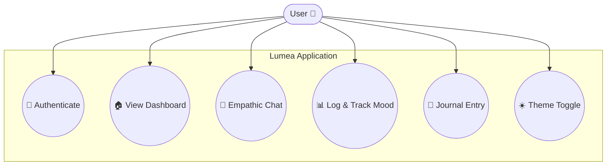
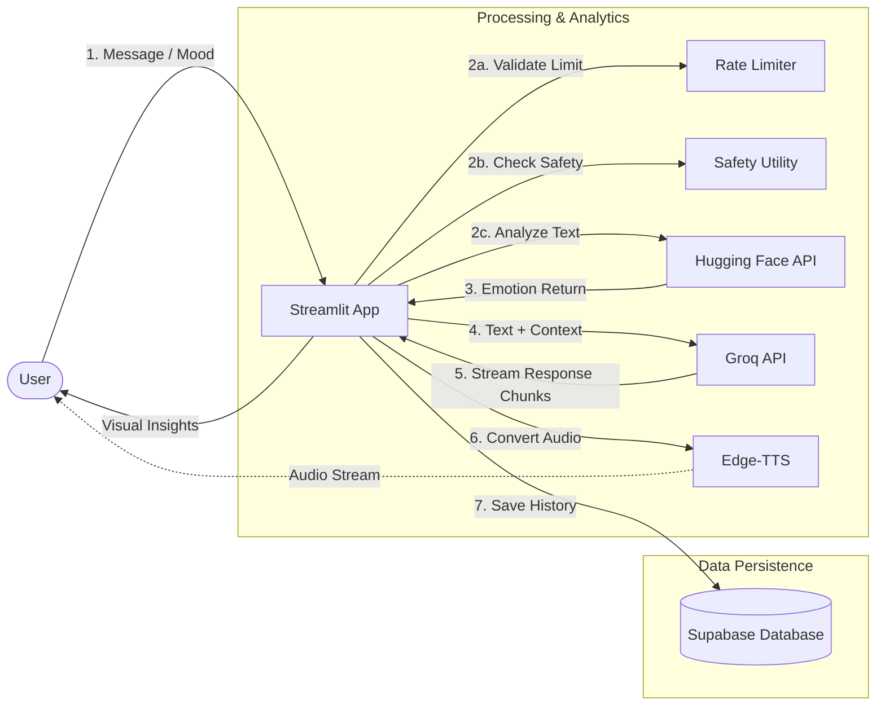
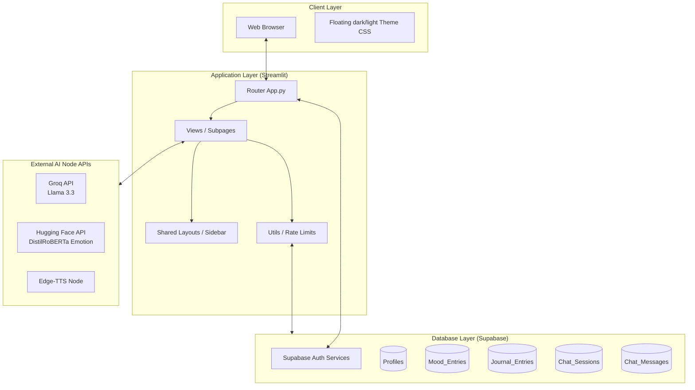

# Lumea - System Architecture & Diagrams 📐

This document provides a visual and structural overview of the **Lumea** AI Mental Health Companion, detailing user interactions, data streaming cycles, and component layering.

---

## 👥 1. Use Case Diagram
Describes how a user interacts with the various functional modules of the application.

---

## 🔄 2. Data Flow Diagram (DFD)
Tracks the flow of information from user input through processing streams down to persistent databases.

---

## 🏛️ 3. Layered System Architecture
Highlights the decomposition of application boundaries from client frameworks to data layers.

---

## 🧩 4. Core Logic Flows

### 💬 Chat Workflow Loop
1. **Input**: User sends statement.
2. **Safety Check**: Immediate interrupt verifies input against `utils/safety.py` imminent self-harm phrasing bounds matching.
3. **Analysis**: Prompt pushes triggers via `DistilRoBERTa` vectors classifying buffers explicitly (e.g., *Sadness 85%*).
4. **Condition Injection**: Static frames append emotional buffers to Groq headers elegantly.
5. **Rendering / Alerting**: 
    - **Safe pass**: Message streams real-time with ambient AI routing.
    - **Trigger pass**: Dialogue holds/suppresses response streams and forces injection of accessible localized support cards to emergency Indian Helplines.
6. **Datalake Sync**: Context pushes into `chat_history` SQL buffers consistently.
