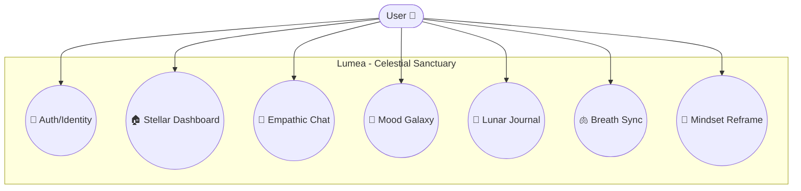

# Lumea - System Architecture & Diagrams 📐

This document provides a visual and structural overview of the **Lumea - Celestial Sanctuary**, detailing user interactions, data streaming cycles, and the modern Next.js component architecture.

---

## 👥 1. Use Case Diagram
Describes how a user interacts with the functional modules of the sanctuary.



---

## 🔄 2. Data Flow Diagram (DFD)
Tracks the flow of information from user input through modern Next.js server actions and API routes.

```mermaid
flowchart LR
    User([User]) -->|1. Message / Emotion| App[Next.js Client]
    
    subgraph Processing_Layer [Processing & Analytics]
        direction TB
        App -->|2. Local Check| RL[Usage Tracker \n LocalStorage]
        App -->|3. Safety Intercept| SF[Safety Library \n 100+ Phrases]
        App -->|4. Text Analysis| HF[/api/emotion \n DistilRoBERTa]
        HF -->|5. Emotion Score| App
        App -->|6. GPT-Context| Groq[/api/chat \n Llama 3.3]
        Groq -->|7. Streaming Chunks| App
    end
    
    subgraph Data_Layer [Data Persistence]
        App -->|8. Sync Data| DB[(Supabase Cloud)]
    end
    
    App -->|9. Interactive UI| User
```

---

## 🏛️ 3. Layered System Architecture (Next.js)
Highlights the decomposition of the "Celestial Sanctuary" architecture.

```mermaid
flowchart TD
    subgraph Presentation_Layer [Presentation Layer]
        UI[Glassmorphism UI]
        Theme[theme.js \n HSL System]
        Components[Shared: PageHeader, GlassCard]
    end

    subgraph Application_Layer [Application Layer - Next.js]
        direction TB
        AppDir[src/app \n App Router]
        Dashboard[Dashboard / Modules]
        API[/api/chat, /api/emotion]
        Lib[src/lib \n Supabase, Safety]
        
        AppDir --> Dashboard
        Dashboard --> API
        Dashboard --> Lib
    end

    subgraph Intelligence_Layer [Intelligence Layer]
        Groq[Groq API \n LLM Core]
        HF[Hugging Face \n NLP Core]
    end

    subgraph Persistence_Layer [Persistence Layer]
        Auth[Supabase Auth]
        Tables[(Supabase Postgres)]
    end

    %% Connectors
    UI <--> AppDir
    API <--> Intelligence_Layer
    Lib <--> Persistence_Layer
```

---

## 🧩 4. Core Logic Flows

### 💬 Chat Workflow: "The Reflection Loop"
1. **User Input**: Statement is received.
2. **Safety Barrier**: Immediate check against `src/lib/safetyPhrases.js` (100+ phrases). If triggered, generation is suppressed, and a support card is shown.
3. **Usage Check**: Local `lumea_usage` verifies the 100-message daily limit.
4. **Typing Animation**: A 2-second "Reflection Delay" is triggered to provide a human-like tempo.
5. **Emotion Tagging**: Text is sent to `/api/emotion`. The resulting sentiment (e.g., *😊 Joy*) is displayed outside the bubble.
6. **Streaming Response**: Groq API (Llama 3.3 70B) generates an empathetic reply, streamed character-by-character into the Glassmorphism bubble.

### 🛡️ Safety & Rate Limiting
- **100+ Phrases**: Robust detection of distressed language.
- **Daily Spirit**: 100 message/day cap to encourage healthy digital boundaries.
- **Immediate Halt**: Logic is baked into the browser-side handleSubmit to ensure no harmful content is processed by the AI.
